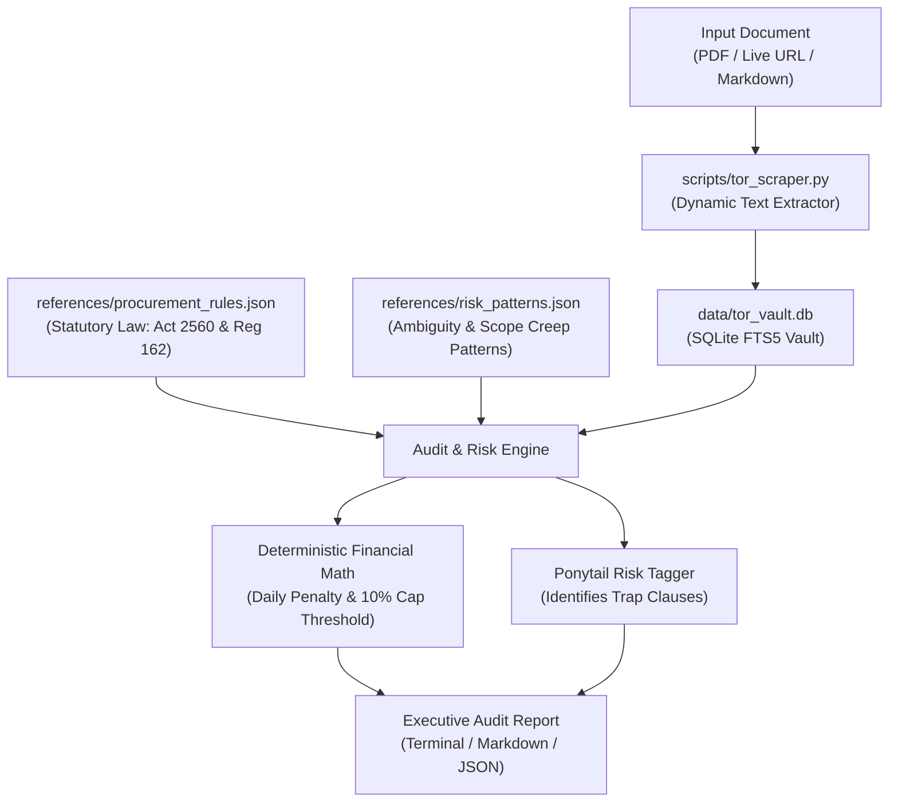

# 🎯 tor-audit: Enterprise TOR & Contract Risk Auditor

[](https://github.com/Zeydsuno/tor-audit/actions)
[](https://www.python.org/)
[](https://www.sqlite.org/fts5.html)
[](LICENSE)
[](#-security--data-governance)
[](#-architecture--performance)

> **Autonomous Sovereign RAG Engine for Terms of Reference (TOR) Auditing, SLA Extraction, and Deterministic Liquidated Damages Calculation.**  
> Designed for enterprise procurement and vendor bid risk management across state enterprises and private conglomerates (PTT Group, SCG, Financial Institutions).

---

## ⚡ Why tor-audit? (Engine Comparison)

| Dimension | Generalist LLMs / ChatGPT Prompt | **tor-audit (This Sovereign Engine)** |
| :--- | :--- | :--- |
| **Financial Math** | Stochastic mental arithmetic, prone to calculation errors | **100% Deterministic Python Math** ($D = V \times R$, 10% statutory cap) |
| **Data Privacy** | Contracts uploaded to third-party US cloud servers | **100% Air-Gapped / On-Premise** (SQLite FTS5, Zero Cloud Leak) |
| **Execution Speed** | 5,000 – 15,000 ms (API network latency & rate limits) | **Sub-5ms** local lexical indexing and evaluation |
| **Statutory Law** | Parametric hallucination of penalty formulas | **Grounded in Public Procurement Act B.E. 2560 & Reg. 162** |
| **Risk Detection** | Generic subjective summaries | **Rule-Based Ponytail Risk Taggers** (`[SCOPE-CREEP-TRAP]`, `[AMBIGUOUS-ACCEPTANCE]`) |
| **Audit Trail** | Nondeterministic, irreproducible across runs | **ISACA CISA Compliant Deterministic Non-Repudiation** |

---

## ⚡ Key Highlights (จุดเด่นทางวิศวกรรม)

- **Zero Parametric Memory:** Never relies on LLM hallucination for penalty rates or contract clauses. Every assertion is grounded in live scraped document text and verified statutory references.
- **Deterministic Math (Python Engine):** Calculates daily penalties ($D = V \times R$), monthly accumulations, and the statutory 10% contract termination ceiling ($C = V \times 0.10$) with 100% precision.
- **Ponytail Risk Tagger:** Hunts down ambiguity traps, scope creep, and unfair clauses (`[SCOPE-CREEP-TRAP]`, `[AMBIGUOUS-ACCEPTANCE]`, `[UNREALISTIC-SLA]`, `[PENALTY-TRAP]`).
- **Sovereign & Air-Gapped Ready:** Runs entirely on-premises using local SQLite FTS5. Zero external vector database dependencies, zero cloud API calls required.
- **Sub-5ms Execution Latency:** Sub-millisecond full-text lexical search and rule evaluation on standard CPU hardware.

---

## 🏛️ Statutory Legal Grounding (กฎหมายและระเบียบอ้างอิง)

| Reference Authority | Section / Clause | Core Mandate |
| :--- | :--- | :--- |
| **พ.ร.บ. การจัดซื้อจัดจ้างฯ พ.ศ. 2560** | **มาตรา 102** | การของด/ลดค่าปรับ หรือขยายเวลาสัญญา เมื่อเกิดจากความผิดของหน่วยงานรัฐ, เหตุสุดวิสัย หรือพฤติการณ์ที่คู่สัญญาไม่ต้องรับผิดตามกฎหมาย |
| **พ.ร.บ. การจัดซื้อจัดจ้างฯ พ.ศ. 2560** | **มาตรา 103** | เพดานบอกเลิกสัญญา: เมื่อค่าปรับสะสมเกิน **ร้อยละ 10** ของวงเงินสัญญา หน่วยงานของรัฐมีสิทธิบอกเลิกสัญญาและริบหลักประกัน (เว้นแต่คู่สัญญายินยอมชำระค่าปรับโดยไม่มีเงื่อนไข) |
| **ระเบียบกระทรวงการคลังฯ พ.ศ. 2560** | **ข้อ 162 (1)** | การซื้อหรือจ้างทั่วไป: กำหนดค่าปรับรายวันร้อยละ **0.01 – 0.20** โดยคิดจาก **ราคาพัสดุส่วนที่ยังไม่ได้รับมอบ** (เว้นแต่งานที่เหลือทำให้ส่วนที่ส่งมอบแล้วใช้งานไม่ได้ ให้คิดจากราคาทั้งหมด) |
| **ระเบียบกระทรวงการคลังฯ พ.ศ. 2560** | **ข้อ 162 (2)** | งานจ้างที่ต้องการผลสำเร็จต่อเนื่อง: คิดค่าปรับเป็นรายวันตามจำนวนวันที่ไม่มาปฏิบัติงาน หรือคิดเป็นร้อยละของ **ราคาค่าจ้างทั้งหมด** |

---

## 🏗️ Architecture



---

## 🚀 Quick Start (การเริ่มต้นใช้งาน)

### 1. Prerequisites & Installation
```bash
git clone https://github.com/Zeydsuno/tor-audit.git
cd tor-audit

# Optional: install pypdf for binary PDF parsing
pip install -r requirements.txt
```

### 2. Standalone Terminal Execution (100% Offline)

#### A. Run Built-in Enterprise IT Cloud Mock:
```powershell
python scripts/tor_scraper.py --scrape-mock --contract-value 50000000 --audit
```

#### B. Audit the Included Sample Enterprise TOR File:
```powershell
python scripts/tor_scraper.py --scrape-file examples/enterprise_cloud_migration_tor.md --contract-value 50000000 --audit
```

#### C. Audit an Actual Local TOR PDF:
```powershell
python scripts/tor_scraper.py --scrape-file "path/to/contract_or_tor.pdf" --contract-value 30000000 --audit
```

#### D. Scrape a Live Procurement Announcement URL:
```powershell
python scripts/tor_scraper.py --scrape-url "https://domain.com/procurement/tor.pdf" --contract-value 20000000 --audit
```

#### E. Pure Liquidated Damages Calculation:
```powershell
python scripts/tor_scraper.py --calc-penalty --contract-value 40000000 --rate 0.001 --days 45
```

#### F. Export Executive Reports (Markdown / JSON):
```powershell
# Export structured Markdown report for management
python scripts/tor_scraper.py --scrape-mock --contract-value 50000000 --audit --export-md report.md

# Export machine-readable JSON for APIs or dashboards
python scripts/tor_scraper.py --scrape-mock --contract-value 50000000 --audit --export-json report.json
```

---

## 🧪 Automated Testing

The project includes a comprehensive unit test suite covering deterministic financial math, statutory cap ceilings, FTS5 tokenization, and risk pattern detection:

```powershell
python -m unittest discover tests
```

---

## 📊 Sample Terminal Output

```text
================================================================================
 🎯 ENTERPRISE TOR AUDIT REPORT: TOR-CURRENT
 มูลค่าสัญญาที่ประเมิน: 50,000,000.00 บาท
================================================================================

[1] 💰 การวิเคราะห์ค่าปรับและเพดานความเสียหาย (LIQUIDATED DAMAGES):
  • อัตราค่าปรับรายวัน : ร้อยละ 0.1% ต่อวัน (50,000.00 บาท/วัน)
  • ค่าปรับสะสมต่อเดือน (30 วัน) : 1,500,000.00 บาท
  • เพดานบอกเลิกสัญญา 10% (ม.103) : 5,000,000.00 บาท
  • ส่งมอบล่าช้าสะสมเกิน : 100 วัน ผู้ว่าจ้างมีสิทธิบอกเลิกสัญญาและริบหลักประกัน

[2] 🚩 จุดเสี่ยงและกับดักในสัญญา (PONYTAIL RISK TAGS):
  • [HIGH] [SCOPE-CREEP-TRAP] ข้อ: ข้อ 3
    ข้อความที่ตรวจพบ: "ข้อ 3 . ขอบเขตของงาน (Scope of Work) 3.1 ผู้รับจ้างต้องดำเนินการย้ายระบบ (Cloud Migration) จากระบบเดิมขึ้นสู่ระบบ Enterprise Cloud Platform 3.2 ผู้รับจ้างต้องพัฒนา API Gateway และเชื่อมโยงข้อมูลกับระบ..."
    แนวทางแก้ไข: ต้องทำหนังสือขอชี้แจง (Clarification Letter) ก่อนยื่นซอง ให้ตัดข้อความปลายเปิดออก หรือจำกัดกรอบงานให้ชัดเจนตามข้อกำหนดหมวด Scope of Work เท่านั้น
  • [HIGH] [AMBIGUOUS-ACCEPTANCE] ข้อ: ข้อ 4
    ข้อความที่ตรวจพบ: "ข้อ 4 . ระยะเวลาดำเนินการและการส่งมอบงาน (Milestones) การดำเนินงานแบ่งออกเป็น 3 งวดงาน รวมระยะเวลา 180 วัน: - งวดที่ 1: ส่งมอบแผนการบริหารโครงการ (Project Charter) และพิมพ์เขียวสถาปัตยกรรมระบบ (Cloud ..."
    แนวทางแก้ไข: ต้องระบุข้อกำหนดให้ยึดเกณฑ์การทดสอบตามเอกสาร Test Scenario / UAT Checklist ที่ลงนามเห็นชอบร่วมกันล่วงหน้า ห้ามใช้ดุลยพินิจอัตวิสัย

[3] ⏱️ ตัวชี้วัดระดับการให้บริการ (SLA PARAMETERS):
  • ข้อ 5: ข้อกำหนดระดับการให้บริการ (Service Level Agreement : SLA)
  • ข้อ 5: 5.2 กรณีเกิดปัญหาขั้นวิกฤต (Priority 1 - Critical Outage) ผู้รับจ้างต้องเข้าแก้ไขปัญหาภายใน 1 ชั่วโมงตลอด 24 ชั่วโมง และต้องทำให้ระบบกลับคืนสู่สภาพเดิมภายใน 2 ช
  • ข้อ 5: 5.3 ระบบต้องมีความพร้อมใช้งาน (Availability Uptime) ไม่ต่ำกว่าร้อยละ 99.95 ต่อเดือน

[4] 📦 งวดงานและการส่งมอบ (DELIVERY MILESTONES):
  • งวดที่ 1: ส่งมอบแผนการบริหารโครงการ (Project Charter) และพิมพ์เขียวสถาปัตยกรรมระบบ (Cloud Architecture Blueprint) ภายใน 30 วัน จ่ายร้อยละ 20 ของมูลค่าสัญญา
  • งวดที่ 2: ดำเนินการติดตั้งระบบ พัฒนา API Gateway และทดสอบระบบนำร่อง ภายใน 120 วัน จ่ายร้อยละ 40 ของมูลค่าสัญญา
  • งวดที่ 3: ดำเนินการย้ายระบบทั้งหมด ทดสอบ UAT และฝึกอบรมบุคลากร ภายใน 180 วัน จ่ายร้อยละ 40 ของมูลค่าสัญญา
================================================================================
```

---

## 📁 Repository Structure

```
tor-audit/
├── .github/
│   └── workflows/
│       └── ci.yml                    # Automated GitHub Actions multi-OS test matrix
├── README.md                         # Project documentation and architecture overview
├── HOW_TO_USE.md                     # Step-by-step user guide and operation manual
├── SKILL.md                          # Antigravity agent cognitive framework & operational rules
├── requirements.txt                  # Python dependencies (minimal / optional)
├── pyproject.toml                    # Standard Python packaging metadata & CLI entrypoint
├── examples/
│   └── enterprise_cloud_migration_tor.md  # Authentic enterprise TOR test sample
├── tests/
│   └── test_audit.py                 # Automated unit tests (math, FTS5, risk tags)
├── scripts/
│   └── tor_scraper.py                # Core scraping, FTS5 indexing, and penalty math engine
├── references/
│   ├── procurement_rules.json        # Authentic Thai Public Procurement Act B.E. 2560 & Reg 162
│   └── risk_patterns.json            # Ambiguity patterns and mitigation playbooks
└── data/
    └── tor_vault.db                  # Local SQLite FTS5 database (auto-generated)
```

---

## 🔒 Security & Data Governance

- **Air-Gapped Compatible:** Operates fully without internet connectivity.
- **Zero Cloud Leak:** All contractual text and financial figures remain strictly inside your local environment.
- **Deterministic Audit Trail:** Consistent, reproducible mathematical outputs compliant with ISACA CISA non-repudiation principles.

---

## 📄 License

This project is licensed under the [MIT License](LICENSE).
