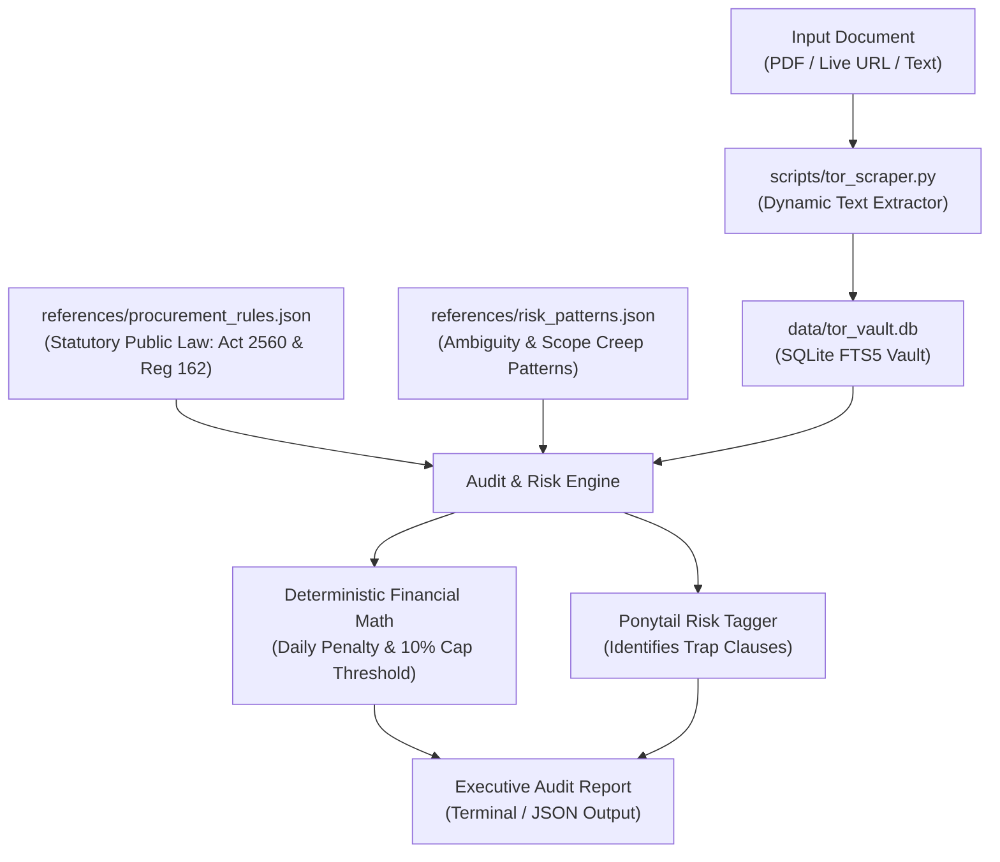

# 🎯 tor-audit: Enterprise TOR & Contract Risk Auditor

[](https://www.python.org/)
[](https://www.sqlite.org/fts5.html)
[](LICENSE)
[](#security--data-governance)
[](#performance)

> **Autonomous Sovereign RAG Engine for Terms of Reference (TOR) Auditing, SLA Extraction, and Deterministic Liquidated Damages Calculation.**  
> Designed for enterprise procurement and vendor bid risk management across state enterprises and private conglomerates (PTT Group, SCG, Financial Institutions).

---

## ⚡ Key Highlights (จุดเด่นทางวิศวกรรม)

- **Zero Parametric Memory:** Never relies on LLM hallucination for penalty rates or clauses. Every assertion is grounded in live scraped document text and verified statutory references.
- **Deterministic Math (Python Engine):** Calculates daily penalties ($D = V \times R$), monthly accumulations, and the statutory 10% contract termination ceiling ($C = V \times 0.10$) with 100% precision.
- **Ponytail Risk Tagger:** Hunts down ambiguity traps, scope creep, and unfair clauses (`[SCOPE-CREEP-TRAP]`, `[AMBIGUOUS-ACCEPTANCE]`, `[UNREALISTIC-SLA]`, `[PENALTY-TRAP]`).
- **Sovereign & Air-Gapped Ready:** Runs entirely on-premises using local SQLite FTS5. Zero external vector database dependencies, zero cloud API calls required for core execution.
- **Sub-5ms Execution Latency:** Sub-millisecond full-text lexical search and rule evaluation on standard CPU hardware.

---

## 🏗️ Architecture



---

## 🚀 Quick Start (การเริ่มต้นใช้งาน)

### 1. Prerequisites
- Python 3.10 or higher
- Optional: `pypdf` for enhanced binary PDF parsing (`pip install pypdf`)

### 2. Standalone Terminal Execution (No AI Required / 100% Offline)

#### Run Built-in Enterprise IT Cloud Modernization Mock:
```powershell
python scripts/tor_scraper.py --scrape-mock --contract-value 50000000 --audit
```

#### Audit an Actual Local TOR PDF:
```powershell
python scripts/tor_scraper.py --scrape-file "path/to/contract_or_tor.pdf" --contract-value 30000000 --audit
```

#### Scrape a Live Procurement Announcement URL:
```powershell
python scripts/tor_scraper.py --scrape-url "https://domain.com/procurement/tor.pdf" --contract-value 20000000 --audit
```

#### Pure Liquidated Damages Calculation:
```powershell
python scripts/tor_scraper.py --calc-penalty --contract-value 40000000 --rate 0.001 --days 45
```

#### Programmatic JSON Output (For Web Dashboards & APIs):
```powershell
python scripts/tor_scraper.py --scrape-mock --contract-value 50000000 --audit --json
```

---

## 📊 Sample Terminal Output

```text
================================================================================
 🎯 ENTERPRISE TOR AUDIT REPORT: TOR-CURRENT
 มูลค่าสัญญาที่ประเมิน: 50,000,000.00 บาท
================================================================================

[1] 💰 การวิเคราะห์ค่าปรับและเพดานความเสียหาย (LIQUIDATED DAMAGES):
  • อัตราค่าปรับรายวัน : ร้อยละ 0.1% ต่อวัน (50,000.00 บาท/วัน)
  • ค่าปรับสะสมต่อเดือน (30 วัน) : 1,500,000.00 บาท
  • เพดานบอกเลิกสัญญา 10% (ม.103) : 5,000,000.00 บาท
  • ส่งมอบล่าช้าสะสมเกิน : 100 วัน ผู้ว่าจ้างมีสิทธิบอกเลิกสัญญาและริบหลักประกัน

[2] 🚩 จุดเสี่ยงและกับดักในสัญญา (PONYTAIL RISK TAGS):
  • [HIGH] [SCOPE-CREEP-TRAP] ข้อ: 4
    ข้อความที่ตรวจพบ: "...รวมถึงงานอื่นๆ ที่ผู้ว่าจ้างมอบหมายเพิ่มเติม และรวมถึงระบบอื่นๆ ที่จะเกิดขึ้นในอนาคต โดยไม่มีค่าใช้จ่ายเพิ่มเติม..."
    แนวทางแก้ไข: ต้องทำหนังสือขอชี้แจง (Clarification Letter) ก่อนยื่นซอง ให้ตัดข้อความปลายเปิดออก หรือจำกัดกรอบงานให้ชัดเจน
  • [HIGH] [AMBIGUOUS-ACCEPTANCE] ข้อ: 5
    ข้อความที่ตรวจพบ: "...ต้องได้รับการอนุมัติจนเป็นที่พึงพอใจของคณะกรรมการตรวจรับพัสดุ ตามดุลยพินิจของคณะกรรมการ..."
    แนวทางแก้ไข: ระบุให้ยึดเกณฑ์การทดสอบตาม UAT Test Scenario Checklist ที่ลงนามเห็นชอบร่วมกันล่วงหน้า ห้ามใช้ดุลยพินิจอัตวิสัย

[3] ⏱️ ตัวชี้วัดระดับการให้บริการ (SLA PARAMETERS):
  • 5.2 Priority 1 (Critical Outage) ต้องเข้าแก้ไขภายใน 1 ชม. และแก้เสร็จภายใน 2 ชม. (24x7)
  • 5.3 Availability Uptime ไม่ต่ำกว่าร้อยละ 99.95 ต่อเดือน

[4] 📦 งวดงานและการส่งมอบ (DELIVERY MILESTONES):
  • งวดที่ 1: ส่งมอบแผนและพิมพ์เขียว Blueprint ภายใน 30 วัน (จ่าย 20%)
  • งวดที่ 2: ติดตั้งและทดสอบระบบนำร่อง ภายใน 120 วัน (จ่าย 40%)
  • งวดที่ 3: ย้ายระบบทั้งหมด UAT และอบรม ภายใน 180 วัน (จ่าย 40%)
================================================================================
```

---

## 📁 Repository Structure

```
tor-audit/
├── README.md                         # Project documentation and architecture overview
├── HOW_TO_USE.md                     # Step-by-step user guide and operation manual
├── SKILL.md                          # Antigravity agent cognitive framework & operational rules
├── scripts/
│   └── tor_scraper.py                # Core scraping, FTS5 indexing, and penalty math engine
├── references/
│   ├── procurement_rules.json        # Authentic Thai Public Procurement Act B.E. 2560 & Reg 162
│   └── risk_patterns.json            # Ambiguity patterns and mitigation playbooks
└── data/
    └── tor_vault.db                  # Local SQLite FTS5 database (auto-generated)
```

---

## 🔒 Security & Data Governance

- **Air-Gapped Compatible:** Operates fully without internet connectivity.
- **Zero Cloud Leak:** All contractual text and financial figures remain strictly inside your local environment.
- **Deterministic Audit Trail:** Consistent, reproducible mathematical outputs compliant with ISACA CISA non-repudiation principles.

---

## 📄 License

This project is licensed under the [MIT License](LICENSE).
